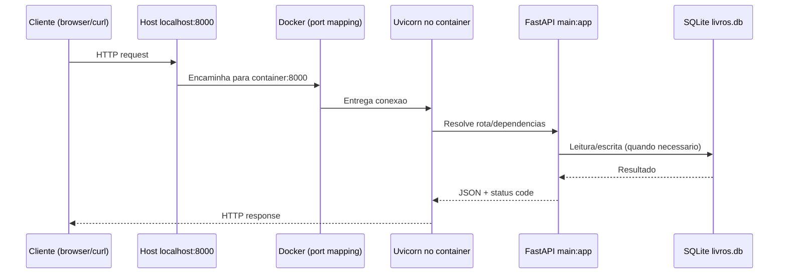

# API de Livros

API REST para gerenciamento de livros com FastAPI, SQLAlchemy e SQLite.

O projeto implementa:
- CRUD completo de livros
- autenticacao HTTP Basic nas rotas de livros
- paginacao na listagem
- exemplo de concorrencia assincrona com `asyncio`
- execucao local com Poetry
- containerizacao com Docker e Docker Compose

## Stack

- Python `>=3.14`
- FastAPI (`fastapi[standard]`)
- SQLAlchemy `2.x`
- SQLite
- Poetry
- Docker e Docker Compose

## Arquitetura da Aplicacao

### Componentes

- `main.py`: aplicacao FastAPI, modelos, rotas, autenticacao e sessao com banco
- `livros.db`: banco SQLite local (arquivo)
- `Dockerfile`: receita para gerar a imagem da API
- `docker-compose.yml`: orquestra o container, porta, volume e variaveis de ambiente
- `.env`: credenciais e configuracao da aplicacao em runtime
- `.dockerignore`: evita enviar arquivos desnecessarios para o build

### Relacao entre `main.py`, imagem Docker e container

1. O `Dockerfile` copia o codigo para `/app` e define o comando:
   `uvicorn main:app --host 0.0.0.0 --port 8000`
2. Isso significa que, dentro do container, o Uvicorn importa `main.py` e executa `app`.
3. No `docker-compose.yml`, o volume `.:/app` monta o projeto da maquina host dentro do container.
4. Resultado: o container roda a aplicacao definida em `main.py`, usando seu codigo atual.

### Build da imagem (`Dockerfile`)

Etapas principais:

1. Base `python:3.14-slim`
2. `WORKDIR /app`
3. Instalacao do Poetry
4. Copia `pyproject.toml` e `poetry.lock`
5. Instalacao das dependencias (`poetry install --no-root`)
6. Copia o restante do projeto
7. Exposicao da porta `8000`
8. Comando padrao para iniciar a API com Uvicorn

### Execucao com Compose (`docker-compose.yml`)

- `build: .`: constroi imagem a partir do `Dockerfile`
- `container_name: livros-api`: nome do container
- `ports: "8000:8000"`: publica a API para a maquina host
- `volumes: .:/app`: sincroniza codigo host/container
- `env_file: .env`: injeta variaveis de ambiente no container
- `command`: comando de start da aplicacao
- `deploy`: configuracoes voltadas a Swarm (nem sempre aplicadas no Compose local)

### Mapeamento de Porta

`"8000:8000"` significa:
- porta `8000` da sua maquina (host)
- encaminhada para a porta `8000` do container

Acesso:
- `http://localhost:8000`

### Fluxo de Requisicao (cliente externo -> container)



## Variaveis de Ambiente

Variaveis lidas pela aplicacao:
- `DATABASE_URL` (padrao: `sqlite:///./livros.db`)
- `MEU_USUARIO` (padrao: `admin`)
- `MINHA_SENHA` (padrao: `admin`)

Variavel presente no `.env` do projeto:
- `PYTHONNUNBUFFERED=1` (configuracao de runtime Python, nao usada diretamente no codigo da API)

Exemplo:

```env
MEU_USUARIO=admin
MINHA_SENHA=admin
DATABASE_URL=sqlite:///./livros.db
PYTHONNUNBUFFERED=1
```

## Endpoints

### Sem autenticacao

| Metodo | Rota | Descricao |
|---|---|---|
| GET | `/` | Health check da API |
| GET | `/chamadas-externas` | Simula 3 chamadas assincronas concorrentes |

### Com HTTP Basic Auth (`-u usuario:senha`)

| Metodo | Rota | Descricao |
|---|---|---|
| GET | `/livros?page=1&limit=10` | Lista livros com paginacao |
| POST | `/adiciona` | Cadastra um livro |
| PUT | `/atualiza/{id_livro}` | Atualiza um livro pelo ID |
| DELETE | `/deletar/{id_livro}` | Remove um livro pelo ID |

## Como Executar

### Local (Poetry)

```bash
poetry install
poetry run uvicorn main:app --reload
```

API em:
- `http://127.0.0.1:8000`

### Docker Compose

```bash
docker compose up --build
```

API em:
- `http://localhost:8000`

## Exemplos de Uso com cURL

```bash
curl "http://127.0.0.1:8000/"
```

```bash
curl "http://127.0.0.1:8000/chamadas-externas"
```

```bash
curl -u admin:admin "http://127.0.0.1:8000/livros?page=1&limit=10"
```

```bash
curl -u admin:admin -X POST "http://127.0.0.1:8000/adiciona" \
  -H "Content-Type: application/json" \
  -d "{\"nome_livro\":\"Clean Code\",\"autor_livro\":\"Robert C. Martin\",\"ano_livro\":2008}"
```

```bash
curl -u admin:admin -X PUT "http://127.0.0.1:8000/atualiza/1" \
  -H "Content-Type: application/json" \
  -d "{\"nome_livro\":\"Clean Code (2a edicao)\",\"autor_livro\":\"Robert C. Martin\",\"ano_livro\":2009}"
```

```bash
curl -u admin:admin -X DELETE "http://127.0.0.1:8000/deletar/1"
```

## Estrutura do Projeto

```text
.
├── .dockerignore
├── .env
├── docker-compose.yml
├── Dockerfile
├── livros.db
├── main.py
├── poetry.lock
├── pyproject.toml
└── README.md
```

## Documentacao Automatica

Com a API rodando:
- Swagger UI: `http://127.0.0.1:8000/docs`
- ReDoc: `http://127.0.0.1:8000/redoc`
- OpenAPI JSON: `http://127.0.0.1:8000/openapi.json`
